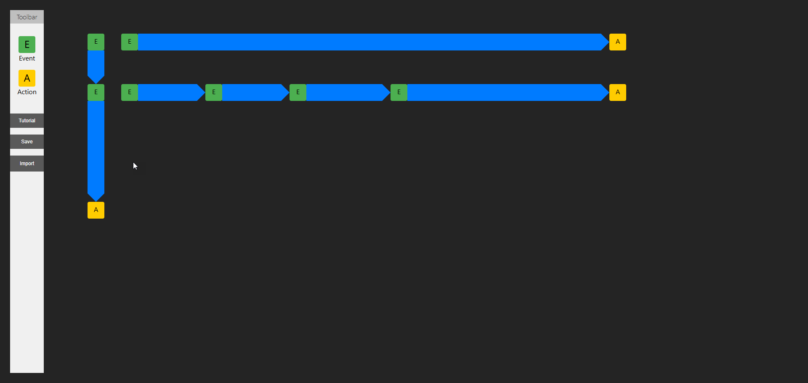

# Node Graph Editor Example

## Synopsis
A simple example of a 2D editor for creating workflow diagrams where you can connect "Events" to other "Events" or "Actions".

## Motivation
Created to demonstrate a performant means of rendering a 2D diagram with lots of interactive nodes by using SVG.

## How To Use
- Drag nodes from the toolbar onto the page to place them
- Drag existing nodes to move them around
- Click on a node to select it, click it again to deselect it
- Press 'Delete' key to remove selected nodes
- With two nodes selected, connect them by pressing 'Enter' key. Events can connect to other Event or Action nodes. The first selected Event node will point to the second selected one. Events will always point to Actions
- Click 'Save' button to save the diagram to a JSON file
- Click 'Import' button to load a diagram from a JSON file

## Try It Out
- Visit the [deployed GitHub Pages site](https://unit2795.github.io/node-graph-editor-example/) to try out the live demo

## Installation and Development
- Run `pnpm install` in the root directory to install dependencies
- Run `pnpm run dev` to start the development server and visit  http://localhost:5173/node-graph-editor-example/
- Run `pnpm run build` to build the project, open the `dist/index.html` file in your browser to view the production build

## Key Technologies
- React
- TypeScript
- SVG
- Vite
- Zustand

## Known Bugs
- A connection line can be formed over a node and obscure it
- When existing node is dragged and leaves confines of grid, it should return to its original position as opposed to continuing to remain active
- When new node is added from toolbar, it momentarily flashes at top left of grid

## Nice To Have
- Could use some refactoring to break things out into different files
- Allow undo/redo actions
- Allow panning/zooming of grid
- Virtualize the grid so that only visible nodes are rendered
- Allow multiple nodes to be connected simultaneously, maybe by drawing a line between them
- Allow sectors to be added to the grid to help organize nodes
- Explore alternate means of rendering the diagram, such as using WebGL, canvas, or a game engine? (This might be overkill and may not be faster or necessary)